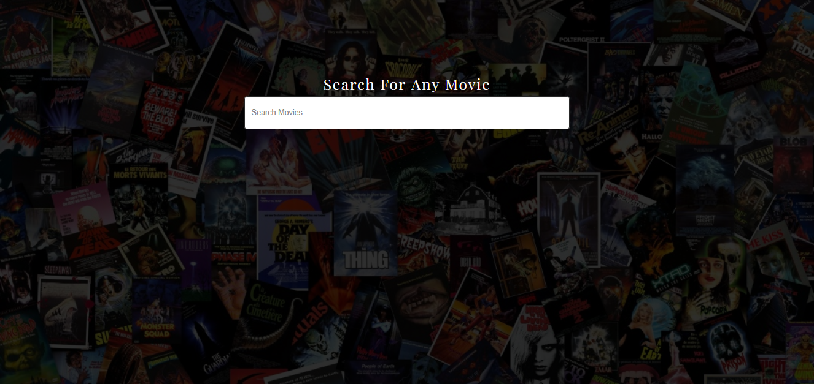

# Movie Search
movieSearch is a movie listing application that let's you search a movie by the movie title and view the details of that particular movie.

## Built With

* [Javascript ES6](https://www.w3schools.com/js/js_es6.asp) 
* [jQuery](https://www.w3schools.com/jquery/)
* [Axios](https://www.npmjs.com/package/axios) for making HTTP requests to the OMDb API.

## Movie details

## Author

Sagar Maharjan - [SagarMhrjn](https://github.com/tetrachromat)

## License

This project is licensed under the MIT License
